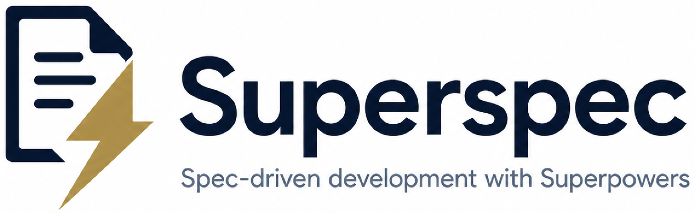

<p align="center">
  
</p>

<p align="center">
  Spec-driven workflow that connects <a href="https://github.com/Fission-AI/OpenSpec">OpenSpec</a> governance with <a href="https://github.com/obra/superpowers">Superpowers</a> execution discipline so a single change is fully traceable from idea → spec → TDD-verified code.
</p>

<p align="center">
  MIT licensed · Schema version 4 · Requires OpenSpec + Superpowers
</p>

<p align="center">
  <a href="README.md">English</a> · <a href="README.zh-CN.md">简体中文</a>
</p>

---

## About Superspec

**Superspec is an integration of OpenSpec and Superpowers**, with OpenSpec as the orchestrator. Today the repository ships a strong-guidance `superspec` schema, and it is also evolving a compatibility-oriented integration story for teams that want to keep native OpenSpec semantics while opting into Superpowers discipline explicitly.

**[OpenSpec](https://github.com/Fission-AI/OpenSpec)** turns feature ideas into versioned, reviewable specs — proposals, capability deltas, and tasks that live in the repo alongside the code.

**[Superpowers](https://github.com/obra/superpowers)** is a set of execution skills for coding agents — brainstorming, plan-writing, TDD, subagent dispatch, and code review — that enforce discipline during implementation.

The two overlap (both produce design and task artifacts) but focus on different domains: OpenSpec governs **spec-driven planning**, Superpowers governs **spec-driven development and implementation**. Used independently, you end up with duplicate documents, parallel task lists, and manual decisions about which skill to invoke at each step.

OpenSpec supports custom schemas, and Superspec's current strong-guidance mode is exactly that — a drop-in schema that picks the best of both frameworks and wires them together for a tightly integrated workflow combining spec-driven and test-driven development. No fork of OpenSpec, no modification to Superpowers skills.

---

## Concepts

> **Looking for the workflow map?** See **[docs/workflow.md](docs/workflow.md)** for the visual overview, or **[docs/workflow-details.md](docs/workflow-details.md)** for the full ten-step breakdown.

Superspec now has two workflow stories:

- **Strong-guidance mode**: the current `superspec` schema, which orchestrates an end-to-end opinionated workflow.
- **Compatibility mode**: a native OpenSpec-first model with explicit Superspec enhancement actions.

See [docs/compatibility-mode.md](docs/compatibility-mode.md) for the compatibility-oriented model.

### The six phases of a strong-guidance Superspec change

Every change moves through the same six phases, in order:

1. **Brainstorm** — nail down the idea for the change through a guided conversation.
2. **Artifact creation** — produce the proposal, optional design, [delta specs](https://github.com/Fission-AI/OpenSpec/blob/main/docs/concepts.md#delta-specs), tasks, and the micro-task plan.
3. **Code implementation** — write the code in an isolated worktree using subagent-driven TDD.
4. **Spec validation** — verify the implementation matches the delta specs and tasks.
5. **Finalization** — the git-side closeout (schema-executed): merge the worktree branch back into your feature branch, push the branch (which updates the existing PR if you opened one for spec pre-review, or creates a remote tracking branch if not), offer to open a code-review PR if none exists yet, record the outcome in `finalize.md`, and post a code-reviewer onboarding comment on whichever PR exists.
6. **Archival** — merge the change's delta specs into the project's living specs and archive the change directory.

Each phase produces concrete artifacts in the change directory and (where applicable) hands off to a Superpowers skill.

---

## Installation

Install [OpenSpec](https://github.com/Fission-AI/OpenSpec/blob/main/docs/installation.md) and [Superpowers](https://github.com/obra/superpowers#installation) first.

From the root of your git repository, run:

```bash
npx openspec-sp init --tools cursor
# or just:
npx openspec-sp init
```

`openspec-sp init` is an enhanced `openspec init`.

It keeps the same `--tools` behavior as `openspec init`, and with no `--tools` argument it enters the same interactive TUI for agent selection. In addition, it verifies the required global OpenSpec configuration, installs the bundled `superspec` schema, installs the bundled project skills into `.codex/skills/`, sets the schema as the default for the current project, and runs a quick verification step.

---

## Quick start

These commands are run **inside your agent harness** (e.g., Cursor's agent mode, Claude Code, Copilot, Codex, or Gemini) — not in a plain shell. The `/opsx:` slash commands are registered by your harness's OpenSpec integration, so type them directly into the agent prompt.

OpenSpec installs both slash commands as well as agent skills for your harness. Agent harness often auto-complete
slash commands and skills. Use the slash commands (starting with `/opsx:...`) instead of the skills.

Example: Archiving a change.
```
/opsx-archive             ==> slash commands (use this)
/openspec-archive-change  ==> skill name (do not use this - slash command will use this implicitly)
```

Once installed, you can choose between the current strong-guidance schema path and the compatibility-oriented path.

### Step-by-step flow (recommended)

Stop at each artifact, review it, give feedback, and only continue when you're satisfied. This is the default flow for any non-trivial change — human-in-the-loop at every checkpoint.

```bash
/opsx:new my-feature   # → starts a new change (use change name or description of what you want to build)
/opsx:continue         # → brainstorm (interactive conversation)
/opsx:continue         # → proposal
/opsx:continue         # → design (optional, only when technical decisions need explanation)
/opsx:continue         # → specs (creates delta specs: ADDED / MODIFIED / REMOVED / RENAMED)
/opsx:continue         # → tasks
/opsx:continue         # → plan
/opsx:apply            # Worktree + Superpowers TDD loop — produces the actual code and writes apply.md (the v2 receipt)
/opsx:verify           # Validate implementation matches the delta specs and tasks (requires apply.md to exist)
/opsx:continue         # → finalize (the git-side closeout: merges worktree → feature branch, pushes branch, offers to open PR if none exists, writes finalize.md, posts code-reviewer comment; v4)
/opsx:archive          # Sync the change's delta specs into project specs, then archive
```

### Quick flow (fast-forward)

For small, well-understood changes where you trust the agent to produce every artifact without per-step review. `/opsx:ff` runs the full artifact-creation pipeline end-to-end with no checkpoints.

```bash
/opsx:ff my-feature    # End-to-end: brainstorm + proposal + design + specs + tasks + plan
/opsx:apply            # Worktree + Superpowers TDD loop — produces the actual code and writes apply.md (the v2 receipt)
/opsx:verify           # Validate implementation matches the delta specs and tasks (requires apply.md to exist)
/opsx:continue         # → finalize (the git-side closeout: merges worktree → feature branch, pushes branch, offers to open PR if none exists, writes finalize.md, posts code-reviewer comment; v4)
/opsx:archive          # Sync the change's delta specs into project specs, then archive
```

### Compatibility mode (native OpenSpec + explicit enhancements)

Use this path when you want to preserve native OpenSpec meanings and opt into Superspec discipline only at specific moments.

```text
openspec-explore            # native open-ended discovery
superspec-brainstorm        # optional structured discovery
openspec-propose            # native change proposal path
openspec-continue-change    # native artifact progression
superspec-plan              # optional micro-planning before implementation
openspec-apply-change       # native implementation path
superspec-apply-change      # optional worktree/TDD/review-backed implementation
openspec-verify-change      # native verification gate
superspec-finalize          # optional enhanced git-side closeout
openspec-archive-change     # native archival and spec sync
superspec-next              # router when you don't know the right next step
```

Start here if you want the full explanation: [docs/compatibility-mode.md](docs/compatibility-mode.md).
For a concrete example flow, see [docs/compatibility-walkthrough.md](docs/compatibility-walkthrough.md).

The `/opsx:` slash commands ship with your harness's OpenSpec integration, not with this schema. If your harness uses different command names, check its OpenSpec docs.

To skip the strong-guidance Superspec schema for a single change and use the upstream schema instead:

```bash
/opsx:new my-simple-fix --schema spec-driven
```

---

## Further reading

- [`docs/workflow.md`](docs/workflow.md) — visual overview and quick mental model for the six-phase workflow
- [`docs/workflow-details.md`](docs/workflow-details.md) — full ten-step walkthrough with per-step rationale, owner, and fallback notes
- [`docs/compatibility-mode.md`](docs/compatibility-mode.md) — native OpenSpec semantics plus explicit Superspec enhancement actions
- [`docs/compatibility-walkthrough.md`](docs/compatibility-walkthrough.md) — example end-to-end compatibility-mode usage paths
- [`docs/project-layout.md`](docs/project-layout.md) — files and directories Superspec adds under `openspec/` after install
- [`openspec/schemas/superspec/README.md`](openspec/schemas/superspec/README.md) — design motivation and rationale
- [`openspec/schemas/superspec/INTEGRATION.md`](openspec/schemas/superspec/INTEGRATION.md) — full lifecycle, CLI cheat sheet, and design choices
- [`openspec/schemas/superspec/schema.yaml`](openspec/schemas/superspec/schema.yaml) — machine-readable schema
- [Fission-AI/OpenSpec](https://github.com/Fission-AI/OpenSpec) — upstream OpenSpec
- [obra/superpowers](https://github.com/obra/superpowers) — Superpowers skills

---

## Credits

Superspec is based on [JiangWay/OpenSpec — `schemas/sdd-plus-superpowers`](https://github.com/JiangWay/OpenSpec/tree/main/schemas/sdd-plus-superpowers), which originated the integration of OpenSpec's spec-driven workflow with Superpowers execution skills. This repository repackages that schema as a standalone, drop-in addition for any OpenSpec project and continues the work as a fork with additional compatibility tooling.

---

## License

[MIT](LICENSE) © 2026 Daniel Hanold and IceChestnut.
